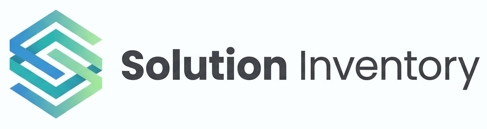

# Solution Inventory

<p align="center">
  
</p>

Vue 3 + Vuetify application for documenting solution questionnaires across multiple projects. Available as both a Progressive Web App (PWA) and an Electron desktop application. It uses a project tree for navigation, questionnaire tabs for editing, and a configuration editor in a dialog.

## Features
- Project tree with create/rename/delete and drag-and-drop (move and reorder questionnaires)
- Questionnaire tabs with close buttons and per-tab state
- Tech Radar: Interactive technology radar visualization with:
  - Drag & drop category chips to assign to quadrants (first 3 categories get dedicated quadrants, remaining grouped in 4th)
  - Click status rings (Adopt/Trial/Assess/Hold/Retire) to toggle visibility
  - Dynamic ring sizing: hidden rings release space for visible ones to expand
  - Search and filter by answer type (Tools/Practices) and categories
  - Export as ThoughtWorks Build-Your-Own-Radar JSON or download as PNG
  - Per-blip overrides: custom status, category assignment, and radar-specific comments
  - Interactive legends with hover sync and detail dialogs
- Project Summary tab: cross-questionnaire matrix (aspect × questionnaire) with colored status chips, comment tooltips, search filter and collapsible categories
- All Suggestions: Aggregated view of all questionnaire answers with radar toggle buttons
- Deviation analysis: configure per-category/aspect rules; violations highlighted with red icons and orange row tint
- Reference questionnaire: designate one questionnaire per project as the baseline for comparison
- Category-based questionnaire with multi-answer entries and entry-level comments
- Status and applicability selects with descriptions
- Resizable sidebar: drag the right edge of the navigation drawer (160–640 px, persisted)
- Configuration editor (dialog) for categories and entries
- Project import/export (JSON and Excel)
- Auto-save to localStorage with last-saved indicator
- Sample data loader in the app bar

## Quick Start

### Installation
```bash
npm install
```

### Development (PWA)
```bash
npm run dev
```

### Development (Electron)
```bash
npm run electron:dev
```

### Production Build (PWA)
```bash
npm run build
```

### Production Build (Electron)
```bash
npm run electron:build
```

### Preview Build (PWA)
```bash
npm run preview
```

### Preview Build (Electron)
```bash
npm run electron:preview
```

### E2E Tests
```bash
npm run test:e2e
```

### Test Report
```bash
npm run test:e2e:report
```

## Project Structure
```
src/
├── main.js
├── App.vue
├── components/
│   ├── TreeNav.vue
│   ├── workspace/
│   │   ├── Workspace.vue
│   │   └── WorkspaceConfig.vue
│   ├── questionaire/
│   │   ├── Questionnaire.vue
│   │   └── QuestionnaireConfig.vue
│   └── projects/
│       ├── ProjectSummary.vue
│       ├── ProjectMatrix.vue
│       ├── ProjectSuggestions.vue
│       ├── CategorySettings.vue
│       └── TechRadar.vue
├── services/
│   └── categoriesService.js
└── stores/
    └── workspaceStore.js

electron/
├── main.js
└── preload.js

public/

scripts/

tests/
├── data/
│   ├── golden_sample_project.json
│   └── sample_questionaire.json
├── features/
│   ├── export-import.feature
│   ├── project.feature
│   └── questionaire.feature
├── step_definitions/
│   ├── export-import.steps.js
│   ├── project.steps.js
│   └── questionaire.steps.js
└── support/
    └── world.js

test-results/
```

## Data Model (high level)
- workspace: projects[] + questionnaires[]
- project: name + questionnaireIds[] + radarRefs[] + radarOverrides[] + radarCategoryOrder[] + deviationSettings{} + referenceQuestionnaireId
- questionnaire: name + categories[]
- radarRef: entryId + option (technology) + questionnaireId
- radarOverride: entryId + option + status + comment + categoryOverride

Metadata includes execution type and architectural role with descriptions.

## Tech Radar Usage

### Adding Blips
In the **Matrix** or **All Suggestions** tab, click the radar icon (🎯) next to any technology answer to add it to the Tech Radar.

### Quadrant Assignment
- Drag & drop the category chips at the top of the Tech Radar to reorder them
- The first 3 categories are assigned to dedicated quadrants (top-left, top-right, bottom-left)
- All remaining categories are grouped in the 4th quadrant (bottom-right)

### Status Ring Visibility
Click any status label (Adopt, Trial, Assess, Hold, Retire) below the radar to toggle its visibility:
- Hidden rings are grayed out
- Blips with hidden status disappear
- Visible rings expand to fill available space

### Customization
Click the menu (⋮) next to any blip in the legend to:
- **Edit**: Override status, assign to different category/quadrant, add radar-specific comments
- **Remove**: Delete from radar

### Export
Use the menu (⋮) in the toolbar to:
- Export as ThoughtWorks Build-Your-Own-Radar JSON format
- Download radar visualization as PNG image

## Project Import/Export
- Export a single project from the project menu.
- Import a project JSON using the import dialog in the project tree header.

## GitHub Pages Deployment
GitHub Actions builds and deploys on push to main. Pushes and PRs to dev build but do not deploy.

## Dependencies
- Vue 3
- Vuetify 3
- Vite
- Pinia
- Playwright (E2E)