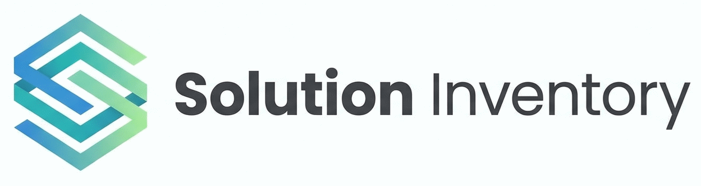

# Solution Inventory

<p align="center">
  
</p>

## What is Solution Inventory?

Solution Inventory is a **questionnaire-based assessment tool** for systematically documenting and comparing technology decisions across software projects within an organization. It helps teams and architects capture which technologies, frameworks, practices, and tools are in use — and at what maturity level — by guiding them through a structured, category-based questionnaire for each solution.

The collected data feeds into cross-project analysis views such as a **Project Summary Matrix**, **Deviation Analysis**, and an interactive **Tech Radar** visualization, enabling organizations to identify patterns, detect inconsistencies, and make informed governance decisions across their solution landscape.

## Who is it for?

- **Software Architects** evaluating and governing technology choices across teams
- **Engineering Managers** seeking visibility into the technologies used by their projects
- **Teams** documenting their solution stacks in a consistent, comparable format
- **Technology Governance Boards** tracking adoption, trial, and retirement of technologies

## How does it work?

### Core Workflow

1. **(Optional) Prepare a Catalog** — Pick one of the built-in catalogs or create/edit your own in the Catalog Editor. A catalog is a reusable template (categories, entries, examples, visibility rules) with no answers.
2. **Create Projects** — Each project represents a software solution to be assessed and selects a default catalog.
3. **Add Questionnaires** — Each project can contain multiple questionnaires (e.g. one per team, component, or assessment cycle). Each is instantiated from a catalog and keeps a provenance link to it.
4. **Answer Questions** — Questions are organized in categories (Architecture, Security, DevOps, etc.). Each entry offers predefined example answers with status levels (Adopt / Trial / Assess / Hold / Retire) and an applicability toggle; irrelevant entries are hidden based on the solution's execution type and architectural role.
5. **Analyze** — Use the Project Summary, Tech Radar, and Deviation Analysis to compare answers across questionnaires and identify patterns.
6. **Export** — Export project data as JSON or Excel, or export the Tech Radar as a ThoughtWorks-compatible JSON, a PNG image, or a self-contained **Custom HTML** page (a no-JavaScript static variant or an editable-JSON variant) for embedding in wikis and intranet pages.

### Data Storage

- **Web App (PWA):** All data is stored exclusively in the browser's Local Storage. There is no server-side storage, accounts, or synchronization. Clearing browser data removes everything.
- **Electron App (Windows & Linux):** All data is stored locally on the device in a user-chosen directory as a single JSON file (`solution-inventory-data.json`). No data is sent to any server or cloud service.
- **Backward compatibility & versioning:** Stored data carries a `version` (storage format) and the exact `appVersion` that wrote it. Older workspaces are migrated forward tolerantly on load (never discarded — an unreadable or unknown-version file surfaces an error instead of being overwritten). Built-in catalogs you have **not** customized are refreshed to their latest shipped content automatically; edited or renamed ones are left untouched.

## Features

### Project & Questionnaire Management
- Project tree with create, rename, delete and drag-and-drop (move and reorder questionnaires)
- Questionnaire tabs with close buttons and per-tab state
- Reference questionnaire: designate one questionnaire per project as the baseline for comparison
- Project import/export (JSON and Excel)

### Question Catalogs (Templates)
- **Catalog library:** manage multiple reusable question catalogs (templates) — create, rename, duplicate, delete; a catalog that is still referenced by a project cannot be deleted
- **Two built-in catalogs ship out of the box:**
  - **Standard Catalog** — the exhaustive, encyclopedic question set (Architecture, Frontend, Backend, Infrastructure & Data, Ops, Security, Hardware & IO, QA)
  - **Software System Interview** — a curated, interview-optimized catalog that separates **Practices** (patterns → reference architectures) from **Tools** (technologies → toolchains), ordered as a natural conversation and including dedicated coverage for machine control / HMI / SCADA systems
- **Catalog Editor** (its own workspace tab): a master-detail structure tree + detail form to edit categories and entries, with
  - Drag & drop reordering of categories, entries (incl. moving entries between categories) and examples — plus up/down buttons as an accessible alternative
  - Undo/redo history and keyboard shortcuts (Ctrl/Cmd+Z / +Shift+Z, Ctrl/Cmd+S to save)
  - Live validation panel (blocking errors vs. advisory warnings) against the catalog schema
  - Editable typed examples, per-entry `description`, `appliesTo` visibility conditions, and metadata options
  - Unsaved-changes guard on every navigation path, 5-second undo on deletions
- Projects choose a **default catalog** on creation; each questionnaire is instantiated from a catalog and keeps a provenance link (`catalogId` / `catalogVersion`)

### Questionnaire Editing
- Category-based questionnaire with multi-answer entries and entry-level comments
- Solution metadata: product name, company, department, contact person, execution type, and architectural role
- Answers can be typed as **Tool** or **Practice**, with suggestions drawn from the matching example type
- Status selects (Adopt / Trial / Assess / Hold / Retire) and applicability toggles with descriptions
- `appliesTo` visibility: entries/categories are shown or hidden based on the solution's execution type and architectural role
- Entries can be hidden per questionnaire to reduce noise
- Sample data loader in the app bar

### Tech Radar
Interactive technology radar visualization inspired by the [ThoughtWorks Technology Radar](https://www.thoughtworks.com/radar):
- Drag & drop category chips to assign categories to quadrants (first 3 categories get dedicated quadrants, remaining grouped in 4th)
- Click status rings (Adopt / Trial / Assess / Hold / Retire) to toggle visibility
- Dynamic ring sizing: hidden rings release space for visible ones to expand
- Search and filter by answer type (Tools / Practices) and by category
- Per-blip overrides: custom status, category assignment, and radar-specific comments
- Interactive legends with hover sync and detail dialogs
- Export as ThoughtWorks Build-Your-Own-Radar JSON, download as PNG, or generate a self-contained **Custom HTML** page — a static no-JavaScript variant for locked-down wikis, or a JSON-data-island variant whose blip list stays hand-editable in the HTML
- Custom HTML Export settings (layout, columns, labels, status colors, category grouping/order, export mode) are **saved with the project**

### Project Summary & Analysis
- **Project Summary Matrix:** cross-questionnaire matrix (aspect × questionnaire) with colored status chips, comment tooltips, search filter, and collapsible categories
- **All Suggestions:** aggregated view of all questionnaire answers with radar toggle buttons
- **Deviation Analysis:** configure per-category/aspect rules; violations highlighted with red icons and orange row tint

### UI & UX
- Resizable sidebar: drag the right edge of the navigation drawer (160–640 px, persisted)
- Auto-save with last-saved indicator
- Installable as a Progressive Web App (PWA)

## Architecture

### Frontend (Vue 3 + Vuetify)

The client application lives in `Client/` and is built with **Vue 3** (Composition API, `<script setup>`), **Vuetify 3** for the component library, and **Pinia** for state management. **Vite** is used as the build tool with PWA support via `vite-plugin-pwa`.

```
User Interaction (Component)  →  Component Handler  →  Store Action  →  State Update  →  Reactive Re-render
```

- **Components** (`src/components/`) handle UI logic and presentation only. The Catalog Editor lives under `src/components/catalog/`; shared dialogs/snackbars under `src/components/common/`, backed by composables in `src/composables/` (confirm dialog, undo snackbar, tab dirty-guard).
- **Store** (`src/stores/workspaceStore.js`) owns all workspace state and mutation logic — project/questionnaire/catalog CRUD, catalog editor drafts, import/export, auto-save, and cross-component state synchronization. Persistence, migrations and factory helpers are extracted into focused modules (`persistence.js`, `migrations.js`, `workspaceFactories.js`, `normalizeCategories.js`).
- **Services** (`src/services/`) provide the built-in catalog seeds: `categoriesService.js` seeds the **Standard Catalog**, `interviewCatalogData.js` provides the **Software System Interview** catalog, and `catalogService.js` builds, instantiates and migrates catalogs.
- **Schema** (`src/schema/`) holds the catalog JSON schema (`catalog.schema.json`) and the runtime validator (`catalogValidation.js`) used by the live validation panel and the fixture tests.

### Electron Shell

The Electron wrapper (`Client/electron/`) enables desktop distribution for Windows and Linux. It provides native file-system access, a directory picker for workspace storage, and a native menu bar. The same Vue/Vuetify frontend runs inside the Electron `BrowserWindow`.

### MCP Server (.NET 9)

The `MCP/McpServer/` directory contains a .NET 9 backend implementing the **Model Context Protocol (MCP)** over SSE transport. It allows AI assistants (e.g. GitHub Copilot) to query workspace data programmatically via JSON-RPC.

Available MCP tools:
| Tool | Description |
|---|---|
| `list_categories` | List all categories and their entries |
| `list_questionnaires` | List questionnaire structure and IDs |
| `get_answers_for_category` | Get filtered answers by category, entry, or questionnaire |
| `get_tech_radar` | Get Tech Radar entries and overrides |
| `evaluate_responses` | Evaluate response consistency and completeness |
| `get_json_schema` | Get JSON schema for workspace or questionnaire export |
| `detect_naming_inconsistencies` | Scan the workspace for case/whitespace variants, near-duplicate typos, and non-canonical identifiers, each with a suggested correction |
| `validate_tech_radar_status` | Validate all status values against the canonical whitelist (Adopt / Trial / Assess / Hold / Retire) and report violations with corrections |
| `export_cleaned_data` | Export a questionnaire in cleaned form (unified technology names, canonical status values, trimmed whitespace) |

The MCP server includes a browser-based management UI at `http://localhost:5100` for loading workspace data and monitoring sessions.

### Tests

- **Unit tests** use **Vitest** with **@vue/test-utils** (`Client/tests/unit/`). They cover the store, catalog build/instantiate/migrate logic, the catalog validator, the catalog editor components, and — as the backbone of backward compatibility — Golden-Master storage-compatibility fixtures (`Client/tests/data/storage/`) that are frozen real payload shapes and must never be edited to make a test pass.
- **End-to-end tests** use **Cucumber.js** with **Playwright** for browser automation. Feature files in `Client/tests/features/` describe scenarios in Gherkin syntax (project CRUD, questionnaire management, import/export). Step definitions in `Client/tests/step_definitions/` implement the browser interactions.
- **Quality gates:** ESLint (flat config, `eslint-plugin-vue`) and Prettier enforce style; `npm run test:unit` runs in CI before the E2E suite.

## Quick Start

### Prerequisites

- **Node.js** (for the frontend)
- **.NET 9 SDK** (optional, only for the MCP server)

### Installation
```bash
cd Client
npm install
```

### Development (PWA)
```bash
npm run dev
```

### Development (Electron, Windows & Linux)
```bash
npm run electron:dev
```

### Production Build (PWA)
```bash
npm run build
```

### Production Build (Electron, Windows & Linux)
```bash
npm run electron:build
```

### Preview Build (PWA)
```bash
npm run preview
```

### Preview Build (Electron, Windows & Linux)
```bash
npm run electron:preview
```

### MCP Server
```bash
cd MCP/McpServer
dotnet run
```
The server starts at `http://localhost:5100`. Open this URL to access the management UI for loading workspace data.

### Unit Tests
```bash
npm run test:unit
```

### Lint & Format
```bash
npm run lint          # ESLint
npm run format        # Prettier (write)
npm run format:check  # Prettier (check only)
```

### E2E Tests
```bash
npm run test:e2e
```

### Test Report
```bash
npm run test:e2e:report
```

## Project Structure
```
Client/                         # Frontend application
├── src/
│   ├── main.js                 # App entry point (Vue + Vuetify + Pinia setup)
│   ├── App.vue                 # Root component (app bar, sidebar, workspace, global dialogs)
│   ├── components/
│   │   ├── TreeNav.vue         # Projects, questionnaires & catalog library navigation
│   │   ├── workspace/
│   │   │   ├── Workspace.vue          # Tab container (questionnaires, summaries, catalog editor)
│   │   │   └── WorkspaceConfig.vue    # Workspace management dialog
│   │   ├── catalog/                   # Catalog Editor (own workspace tab)
│   │   │   ├── CatalogEditor.vue      # Container: header, dirty state, save/undo/redo, layout
│   │   │   ├── EditorTree.vue         # Structure tree: search, context menus, drag & drop
│   │   │   ├── CategoryForm.vue       # Category detail form
│   │   │   ├── EntryForm.vue          # Entry detail form (aspect, id, description, examples)
│   │   │   ├── ExamplesEditor.vue     # Typed Practice/Tool examples editor
│   │   │   ├── AppliesToEditor.vue    # appliesTo visibility condition editor
│   │   │   ├── MetadataOptionsForm.vue# Metadata-category option lists
│   │   │   └── ValidationPanel.vue    # Live validation findings (errors/warnings)
│   │   ├── common/
│   │   │   ├── ConfirmDialog.vue      # Promise-based confirm dialog (replaces window.confirm)
│   │   │   └── UndoSnackbar.vue       # Undo snackbar (replaces alert)
│   │   ├── questionaire/
│   │   │   ├── Questionnaire.vue      # Category-based questionnaire editor
│   │   │   └── EntryExamples.vue      # Example answers for entries
│   │   └── projects/
│   │       ├── ProjectSummary.vue     # Cross-questionnaire summary & analysis
│   │       ├── ProjectMatrix.vue      # Aspect × questionnaire comparison matrix
│   │       ├── ProjectSuggestions.vue # Aggregated answer view with radar toggles
│   │       ├── CategorySettings.vue   # Deviation analysis rule editor
│   │       ├── CustomHtmlExportDialog.vue # Custom HTML export options
│   │       └── TechRadar.vue          # Interactive Tech Radar visualization
│   ├── composables/
│   │   ├── useConfirm.js              # Confirm-dialog state (singleton)
│   │   ├── useUndoSnackbar.js         # Undo-snackbar state (singleton)
│   │   └── useWorkspaceTabGuard.js    # Shared unsaved-changes tab guard
│   ├── services/
│   │   ├── categoriesService.js       # Standard Catalog seed data
│   │   ├── interviewCatalogData.js    # "Software System Interview" catalog seed data
│   │   └── catalogService.js          # Build / instantiate / migrate catalogs
│   ├── schema/
│   │   ├── catalog.schema.json        # Catalog JSON schema (documentation + contract)
│   │   └── catalogValidation.js       # Runtime catalog validator (errors/warnings)
│   ├── stores/
│   │   ├── workspaceStore.js          # Pinia store (state, actions, orchestration)
│   │   ├── persistence.js             # localStorage / Electron-file I/O
│   │   ├── migrations.js              # Storage-format migrations (v1→v2→v3)
│   │   ├── workspaceFactories.js      # Workspace/project/questionnaire factories
│   │   └── normalizeCategories.js     # Instance-field normalization
│   └── utils/
│       └── techRadarExport.js         # Tech Radar export helpers
├── electron/
│   ├── main.js                 # Electron main process
│   └── preload.js              # Electron preload script (IPC bridge)
├── tests/
│   ├── unit/                   # Unit tests (Vitest + @vue/test-utils)
│   ├── data/storage/           # Golden-Master storage-compatibility fixtures
│   ├── features/               # Gherkin feature files (Cucumber + Playwright)
│   ├── step_definitions/       # Step implementation
│   └── support/                # Test world configuration
├── vitest.config.js            # Vitest config
├── eslint.config.js            # ESLint flat config
├── vite.config.js              # Vite config (PWA + Electron modes)
└── package.json

MCP/                            # MCP Server (.NET 9)
└── McpServer/
    ├── Program.cs              # Server setup, routes, middleware
    ├── Data/
    │   └── ProjectRepository.cs   # Workspace data access layer
    ├── Logic/
    │   └── QuestionnaireEvaluator.cs  # Response evaluation logic
    ├── Models/                 # Data model classes
    ├── Services/
    │   ├── McpSessionManager.cs    # MCP protocol (SSE + JSON-RPC)
    │   ├── ConfigService.cs        # Server configuration
    │   ├── JsonSchemas.cs          # JSON schema generation
    │   └── LogBroadcaster.cs       # WebSocket log streaming
    └── wwwroot/                # Management UI (static files)
```

## Data Model

A **Catalog** is a reusable template (structure only, no answers); a **Questionnaire** is an instance of a catalog with answers filled in. The persisted snapshot carries a storage-format `version` and the `appVersion` that wrote it.

```
Workspace
├── catalogs[]                    # Reusable question catalogs (templates)
│   ├── id, name, description
│   ├── version                   # Bumped on structural revision
│   ├── schemaVersion             # Catalog schema version
│   ├── statusOptions[], applicabilityOptions[]
│   └── categories[]
│       ├── id, title, desc, isMetadata, appliesTo?
│       ├── metadataOptions{}         # Only on the metadata category
│       └── entries[]
│           ├── id, aspect, description?, appliesTo?
│           └── examples[]            # Typed examples:
│               └── { type: 'practice' | 'tool', label, description }
│                   # legacy { label, description, tools[] } still read tolerantly
├── projects[]
│   ├── id, name
│   ├── defaultCatalogId           # Catalog chosen when creating the project
│   ├── questionnaireIds[]         # References to questionnaires
│   ├── radar[]                    # Tech Radar blips
│   │   ├── entryId, option        # Which technology
│   │   ├── status, category       # Overrides
│   │   └── shortComment, description, link, mandatory
│   ├── radarCategoryOrder[]       # Category display order on the radar
│   ├── radarCategoryQuadrants{}   # Category → quadrant assignment
│   ├── radarQuadrantLabels{}      # Custom quadrant labels
│   ├── radarExportSettings{}      # Saved Custom HTML Export dialog settings
│   ├── deviationSettings{}        # Deviation analysis rules
│   └── referenceQuestionnaireId   # Baseline questionnaire
└── questionnaires[]
    ├── id, name
    ├── catalogId?, catalogVersion?   # Provenance of the source catalog (optional)
    └── categories[]                  # Deep copy incl. answers, applicability, metadata
        ├── id, title, desc
        ├── isMetadata             # Metadata category (solution description)
        ├── metadata{}             # Product name, company, contact, execution type, role
        └── entries[]
            ├── id, aspect, examples[]
            ├── answers[]          # Selected options with status and answer type
            ├── applicability      # applicable / not applicable / unknown
            └── entryComment       # Entry-level notes
```

Solution metadata includes **execution type** (Web App, Desktop, Mobile, Headless Service, etc.) and **architectural role** (Standalone, Microservice, Plugin, AI/ML Engine, etc.), which drive the `appliesTo` visibility of catalog categories and entries.

## Tech Radar Usage

### Adding Blips
In the **Matrix** or **All Suggestions** tab, click the radar icon next to any technology answer to add it to the Tech Radar.

### Quadrant Assignment
- Drag & drop the category chips at the top of the Tech Radar to reorder them
- The first 3 categories are assigned to dedicated quadrants (top-left, top-right, bottom-left)
- All remaining categories are grouped in the 4th quadrant (bottom-right)

### Status Ring Visibility
Click any status label (Adopt, Trial, Assess, Hold, Retire) below the radar to toggle its visibility:
- Hidden rings are grayed out
- Blips with hidden status disappear
- Visible rings expand to fill available space

### Customization
Click the menu (⋮) next to any blip in the legend to:
- **Edit**: Override status, assign to different category/quadrant, add radar-specific comments
- **Remove**: Delete from radar

### Export
Use the menu (⋮) in the toolbar to:
- Export as ThoughtWorks Build-Your-Own-Radar JSON format
- Download radar visualization as PNG image
- Open the **Custom HTML Export** dialog to generate a self-contained, styled HTML page

#### Custom HTML Export
The Custom HTML Export produces a standalone HTML page (blip cards grouped by status or category) tailored for embedding in wikis or intranet pages. All dialog settings — layout, columns, labels, status colors, category grouping/order, included statuses, and the export mode — are **saved with the project** and restored the next time you open the dialog. Two output modes are available:

- **Static (no JS):** pure HTML + CSS with no `<script>`; renders on pages that forbid JavaScript. Change the content by editing it in the app and re-exporting.
- **JSON + JS:** embeds the blip list as an editable JSON data island plus a small inline renderer, so the data stays hand-editable directly in the HTML. Requires JavaScript on the target page.

See [docs/tech-radar-custom-export.md](docs/tech-radar-custom-export.md) for the embedding and JSON-editing guide.

## Deployment

### GitHub Pages (PWA)
GitHub Actions builds and deploys automatically on push to `main`. The web version is hosted at GitHub Pages. Pushes and PRs to `dev` build but do not deploy.

### Electron (Desktop)
```bash
cd Client
npm run electron:build
```
Produces platform-specific installers in `Client/release/`.

## Dependencies

### Frontend
- [Vue 3](https://vuejs.org/) — Reactive UI framework (Composition API)
- [Vuetify 3](https://vuetifyjs.com/) — Material Design component library
- [Pinia](https://pinia.vuejs.org/) — State management
- [Vite](https://vitejs.dev/) — Build tool with HMR
- [vuedraggable](https://github.com/SortableJS/vue.draggable.next) — Drag & drop for the catalog editor (tree & examples)
- [markdown-it](https://github.com/markdown-it/markdown-it) / [md-editor-v3](https://github.com/imzbf/md-editor-v3) — Markdown rendering and editing
- [html-to-image](https://github.com/nicbarker/html-to-image) — PNG export for Tech Radar

### Desktop
- [Electron](https://www.electronjs.org/) — Cross-platform desktop shell

### Testing & Quality
- [Vitest](https://vitest.dev/) + [@vue/test-utils](https://test-utils.vuejs.org/) — Unit tests
- [Playwright](https://playwright.dev/) — Browser automation
- [Cucumber.js](https://cucumber.io/) — BDD test framework
- [ESLint](https://eslint.org/) + [eslint-plugin-vue](https://eslint.vuejs.org/) / [Prettier](https://prettier.io/) — Linting & formatting

### MCP Server
- [.NET 9](https://dotnet.microsoft.com/) — Backend runtime
- ASP.NET Core Minimal APIs — HTTP + SSE + WebSocket endpoints